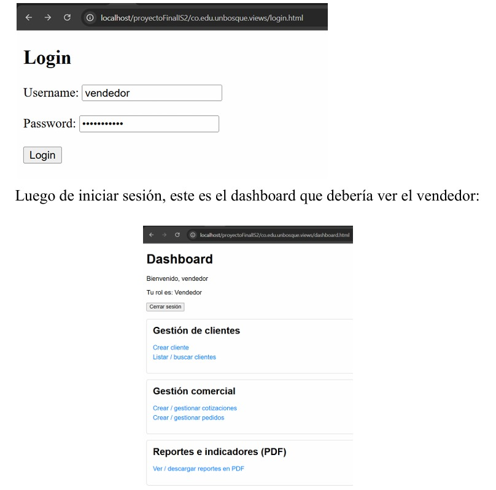
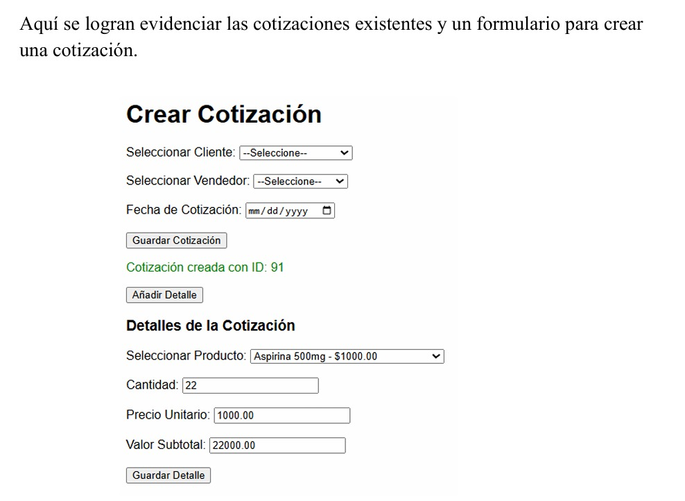
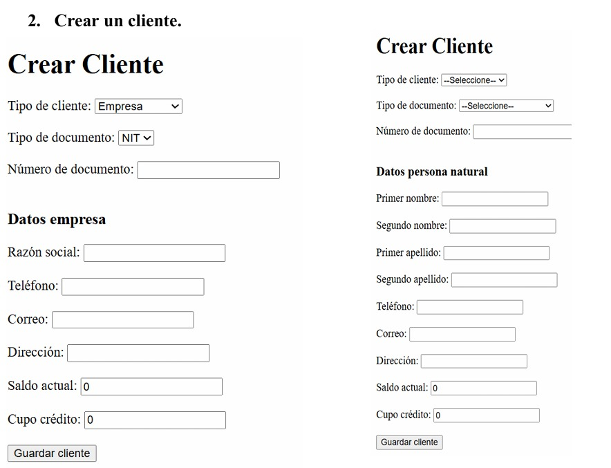
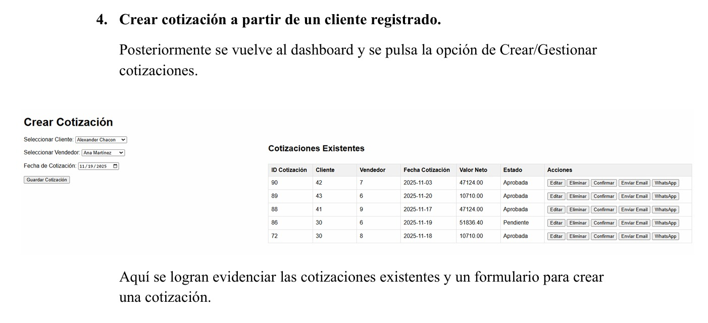
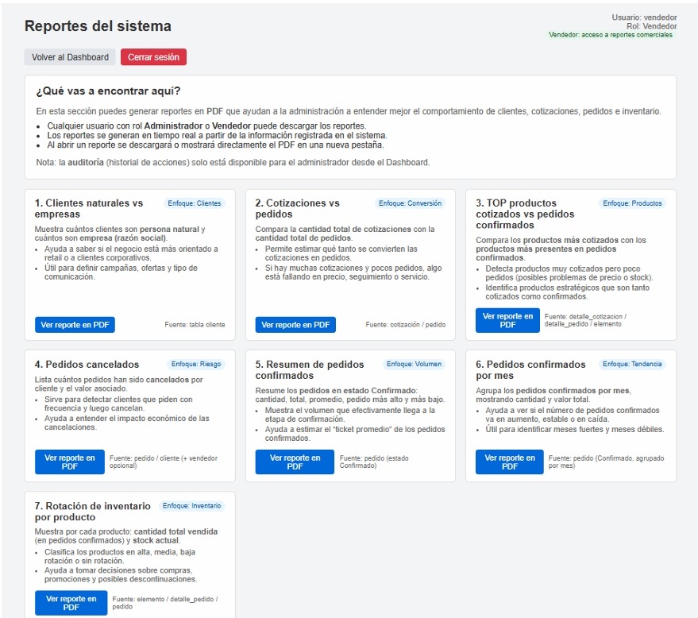
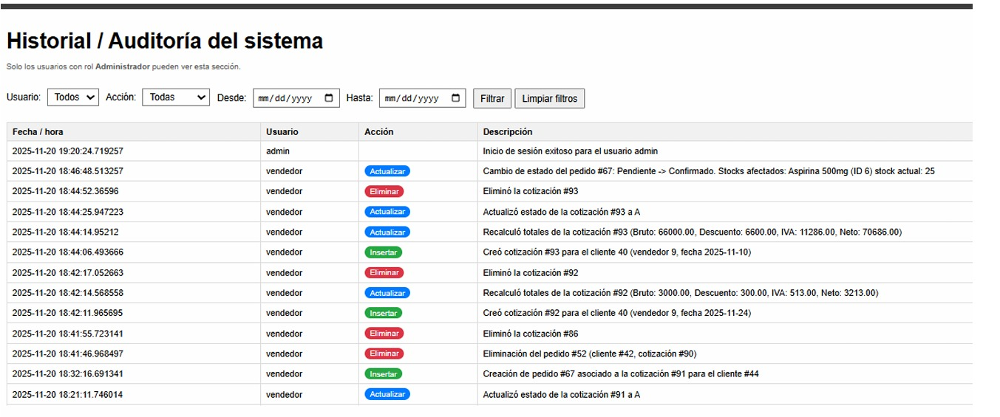

<h1 align="center">SophyFarm — Sistema de Gestión de Cotizaciones y Pedidos</h1>

<p align="center">
  
  
  
  
  
</p>

<p align="center">
  Proyecto académico · Ingeniería de Sistemas · Universidad El Bosque · Ago 2025 – Nov 2025
</p>

---

## Descripción

SophyFarm es un sistema de gestión de cotizaciones y pedidos desarrollado para una cadena local de droguerías. Permite a vendedores y administradores gestionar el ciclo comercial completo: desde la generación de cotizaciones personalizadas hasta su conversión en pedidos con seguimiento en tiempo real.

El sistema está construido sobre una **arquitectura de microservicios** donde cada servicio es independiente, escalable y se comunica a través de **APIs REST**. La autenticación y el control de acceso se implementaron con **JWT (JSON Web Tokens)**.

---

## Funcionalidades principales

- Creación, edición y seguimiento de **cotizaciones** por vendedor
- Conversión de cotizaciones aceptadas en **pedidos** con estados (Pendiente / Confirmado / Cancelado)
- Gestión de **clientes** y su historial comercial
- Catálogo de **productos** disponibles para cotizar
- **Notificaciones automáticas** por correo electrónico y WhatsApp al confirmar pedidos
- Generación de **reportes PDF** de ventas y estadísticas
- Panel de **auditoría** para el administrador
- Autenticación segura con **JWT** y control de acceso por rol

---

## Stack tecnológico

| Capa | Tecnología |
|------|------------|
| **Backend** | PHP (Arquitectura de Microservicios) |
| **Base de datos** | PostgreSQL 12 |
| **Autenticación** | JWT (JSON Web Tokens) |
| **Servidor local** | XAMPP (Apache) |
| **Reportes PDF** | FPDF |
| **Admin BD** | DBeaver |
| **Entorno servidor** | Debian 11 (Máquina Virtual — VirtualBox) |
| **IDE** | Visual Studio Code |

---

## Arquitectura del sistema

El proyecto está dividido en los siguientes microservicios independientes:

```
SophyFarm/
├── ms-cotizacion/       → Gestión de cotizaciones (crear, editar, eliminar, convertir a pedido)
├── ms-pedido/           → Gestión de pedidos y estados
├── ms-cliente/          → Información y relación de clientes
├── ms-producto/         → Catálogo de productos disponibles
├── ms-autenticacion/    → JWT, roles y control de acceso
└── ms-notificacion/     → Notificaciones por email y WhatsApp
```

Todos los microservicios se conectan a una base de datos PostgreSQL centralizada y se comunican entre sí mediante API REST.

---

## Roles de usuario

| Rol | Acceso |
|-----|--------|
| **Administrador** | Control total: auditoría, reportes, gestión completa |
| **Vendedor** | Cotizaciones, pedidos, clientes asignados y reportes propios |
| **Cliente** | Solo visualización de sus cotizaciones y pedidos |

---

## Instalación y configuración local

### Requisitos previos

- [XAMPP v3.3.0](https://www.apachefriends.org/) (módulos Apache y MySQL activos)
- [PostgreSQL 12](https://www.postgresql.org/) corriendo en Debian 11 (VirtualBox)
- [DBeaver](https://dbeaver.io/) para administración de la BD
- [VirtualBox](https://www.virtualbox.org/) con imagen `debian-11.6.0-amd64-netinst.iso`
- Visual Studio Code con extensiones: `PHP IntelliSense`, `PHP Server`, `SQLTools`

### 1. Clonar el repositorio

```bash
git clone https://github.com/SamuelRol1109/sophyfarm.git
cd sophyfarm
```

### 2. Configurar la base de datos

Edita el archivo `DbConfig.php` con los parámetros de tu instancia de PostgreSQL:

```php
define('DB_HOST', '192.168.1.12');   // Aquí, ingresa la IP de tu máquina virtual Debian
define('DB_NAME', 'sophyfarm');
define('DB_USER', 'postgres');
define('DB_PASS', '1234');
```

### 3. Configurar la máquina virtual (Debian 11 + PostgreSQL)

En VirtualBox, configura la red de la VM así:
- **Adaptador 1:** NAT (acceso a internet)
- **Adaptador 2:** Bridged (conexión a red local — genera la IP que usarás en `DB_HOST`)

Habilita el acceso remoto a PostgreSQL editando `/etc/postgresql/12/main/postgresql.conf`:

```bash
listen_addresses = '*'
```

Y en `/etc/postgresql/12/main/pg_hba.conf`:

```
host    all    all    0.0.0.0/0    md5
```

Reinicia el servicio:

```bash
sudo systemctl restart postgresql
```

### 4. Levantar el servidor web

Coloca el proyecto en la carpeta `htdocs` de XAMPP y accede desde el navegador:

```
http://localhost/proyectoFinalIS2/co.edu.unbosque.views/login.html
```

---

##  Validación funcionamiento del sistema

| | |
|:---:|:---:|
|  |  |
| 🔐 Login | 📋 Crear Cotización |
|  |  |
| 👤 Crear Cliente | 🛒 Cotización por Cliente |
|  |  |
| 📊 Reportes | 🔍 Auditoría |

---
## Documentación

El repositorio incluye documentación completa del proyecto:

- `docs\proyecto_cotizaciones\docs\ManualInstalaciónYDespliegueMV(CotizacionesYPedidos).txt` — Manual de usuario con flujos detallados por rol
- `docs\manual-vm.pdf` — Guía de configuración de la máquina virtual Debian 11 + PostgreSQL

---

## Equipo de desarrollo

| Nombre | GitHub |
|--------|--------|
| Samuel Julián Rodríguez Chávez | [@SamuelRo1109](https://github.com/SamuelRo1109) |
| Natalia Vanesa Martínez Rodríguez | — |
| Abraham Pesca Prada | — |

---

## Contacto

**Samuel Rodríguez**
- sjurodriguez@gmail.com
- [LinkedIn](https://www.linkedin.com/in/samuel-rodriguez-b720a73b5/)
- [GitHub](https://github.com/SamuelRo1109)
